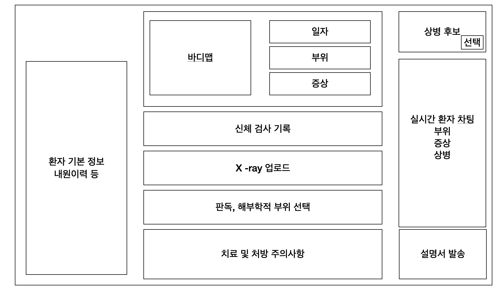

좋습니다. 아래는 **진료 프로세스 맞춤 차팅 보조 UI**를 빠르게 프로토타입하고 팀 내 합의를 이끌 수 있도록 만든 **React 개발 지시서(코드 불필요, 실행지침 중심)**입니다.

(전제: Next.js + TypeScript + Tailwind + shadcn/ui / 전역상태는 Zustand 또는 RTK Query 조합)

---

# 1) 목표·범위·원칙

* **목표:** 환자 호소 입력 → 신체검진 기록 → 영상 첨부/판독 → 상병 후보 결정 → 치료/처방 선택 → 요약서 발송까지 **단일 스텝플로우**로 완료.
* **핵심 가치:**
  1. 부위/증상 입력 시 **Dermatome 매핑 기반 1차 상병 후보 자동화**
  2. 정형 템플릿으로 **신경학적 손상 위치·정도·심각도** 추정
  3. 영상 판독 후 **해부학적 필터**로 후보 축소 → 최종 상병 결정
  4. 상병별 **치료/처방·주의사항** 즉시 가시화
  5. **요약서 자동 구성** 및 전송
* **설계 원칙:** 환자 안전 최우선(금기/상호작용 가드레일), 입력 최소화(자동완성/템플릿), 근거 투명성(“왜 이 후보/경고인지” 표시), 재현성(감사로그).

---

# 2) 사용자 흐름(스텝퍼)

1. **증상/부위 입력**
   * 바디맵 클릭으로 부위 선택(전/후면), 증상 양상·발생경위·시작일 입력
   * 입력 완료 즉시 **Dermatome 히트맵** 노출 + **1차 상병 후보** 카드 리스트(스코어/근거 배지)
2. **신체검사 기록**
   * 템플릿(휴대성 높은 섹션 카드): Tenderness, SLR, motor, sensory, DTR, Ankle Clonus
   * 저장 시  **손상 위치·정도·심각도 추정** (라벨·근거 리스트 표시)
3. **영상(MRI/X-ray) 첨부·판독 메모**
   * 파일/URL 첨부, 판독 메모 입력, 필요 시 썸네일/탭 전환
4. **상병 후보 정제·선택**
   * 입력 부위/영상 기반 **해부학 필터** 적용된 2차 후보 리스트
   * 후보별 증거/스코어/관련 dermatomes/검사 근거를 펼침으로 확인 후 **1건 선택**
5. **치료·처방 선택 & 주의사항 확인**
   * 상병별 추천(주사/시술/약물) 리스트
   * 항목 클릭 시  **주의사항 모달** (금주, 금기, 상호작용, 기저질환) → 충돌 시 차단/확인
6. **요약서 생성·발송**
   * 자동 생성된 요약 편집 가능(상병 설명, 환자 상태, 영상, 계획, 주의사항)
   * **PDF 내보내기 / SMS·이메일 전송** 버튼

---

# 4) 데이터·룰 테이블(제품 외부 의학 검증 전 가이드)

* **Dermatome 매핑:** BodyRegion ↔ Dermatomes[] (예: thigh→L2/L3, leg→L4/L5/S1 등)
* **후보 규칙:** (dermatome, 통증양상, 메커니즘, 검진 소견) → 후보 상병 + 가중치/근거 문자열
  * 예시 규칙 의도: “좌하지 방사통 + SLR 양성 + L5 분절 감각저하 → L4/5 디스크 후보 가중치↑”
* **신경학 추정:** motor grade, sensory impairment, DTR 변화, clonus 조합으로
  * **추정 레벨(예: L4/L5)** ,  **심각도(mild/moderate/severe)** , **근거리스트** 산출
* **치료/주의사항 사전:** 상병코드→치료옵션[], 옵션→주의사항Key[]
  * 주의사항Key→표준 문구(금주/항응고제/임신/간·신장/NSAIDs 상호작용 등)

> **지침:** 프로토타입은 “연결·흐름 검증”이 우선. 룰·사전은 의학자문 단계에서 정교화.

---

# 5) 예시 UI



### 바디맵, 일자, 부위, 증상

* 바디맵을 클릭하면 부위 영역에 떠야함. 중복선택가능
* 바디맵을 클릭하면 저장된 더마톰에 의해 관련 1차 상병 후보가 우측 영역에 상병명만 간단하게 뜨고, 상병명을 클릭하면 상병코드와 상병명을 함께 볼 수 있음
* 증상은 일단 텍스트 입력으로 두면 됌
* 일자는 스핀상자를 세개 둔다. N일전, M주전, L달전 으로 두어서 확인을 누르면, 현재 날짜에서 계산하여 '대략 20XX.XX.XX' 로 표기 가능

### 신체검사 기록

```
import React, { useState } from "react";
import { Card, CardContent, CardHeader, CardTitle } from "@/components/ui/card";
import { Button } from "@/components/ui/button";
import { Input } from "@/components/ui/input";
import { Label } from "@/components/ui/label";
import { Textarea } from "@/components/ui/textarea";
import { Switch } from "@/components/ui/switch";
import { Select, SelectContent, SelectItem, SelectTrigger, SelectValue } from "@/components/ui/select";
import { Badge } from "@/components/ui/badge";
import { X } from "lucide-react";

// ---------------------------------------------
// Constants & small helpers
// ---------------------------------------------
const reflexScale = ["0", "1+", "2+", "3+", "4+"] as const; // DTR
const motorScale = ["0", "1", "2", "3", "4", "5"] as const; // MRC scale
const sensoryScale = ["정상", "감소", "소실"] as const;

const bodyRegions = [
  "경추(목)",
  "흉추(등)",
  "요추(허리)",
  "천장관절(SIJ)",
  "둔부",
  "고관절",
  "무릎",
  "발목",
  "발/발가락",
] as const;

const MOTOR_KEYS = [
  "L2(고관절굴곡)",
  "L3(무릎신전)",
  "L4(발목배굴)",
  "L5(엄지신전)",
  "S1(발바닥굴곡)",
] as const;

const SENSORY_KEYS = ["L2", "L3", "L4", "L5", "S1"] as const;
const DTR_KEYS = ["무릎반사(L4)", "발목반사(S1)"] as const;

type Side = "좌" | "우";
type LR = { 좌: string; 우: string };

const makeDefaultLR = (keys: readonly string[], val: string): Record<string, LR> => {
  const o: Record<string, LR> = {};
  keys.forEach((k) => (o[k] = { 좌: val, 우: val }));
  return o;
};

const DEFAULT_MOTOR = makeDefaultLR(MOTOR_KEYS, "5");
const DEFAULT_SENSORY = makeDefaultLR(SENSORY_KEYS, "정상");
const DEFAULT_DTR = makeDefaultLR(DTR_KEYS, "2+");

// ---------------------------------------------
// Tiny smoke tests (run once in browser)
// ---------------------------------------------
(function runSmokeTests() {
  try {
    console.assert("L2(고관절굴곡)" in DEFAULT_MOTOR, "motor default key missing");
    console.assert(DEFAULT_MOTOR["L2(고관절굴곡)"].좌 === "5", "motor default value incorrect");
    console.assert("무릎반사(L4)" in DEFAULT_DTR, "dtr default key missing");
    console.assert(DEFAULT_SENSORY["L5"].우 === "정상", "sensory default value incorrect");
  } catch (e) {
    // Do not crash UI; only log in console
    console.warn("[NeuroExam] Smoke tests failed:", e);
  }
})();

// ---------------------------------------------
// Component
// ---------------------------------------------
export default function NeuroExamForm() {
  const [tenderness, setTenderness] = useState<string[]>([]);
  const [tendernessNote, setTendernessNote] = useState("");

  const [slr, setSlr] = useState({
    좌: { 양성: false, 각도: "", 방사통: "" },
    우: { 양성: false, 각도: "", 방사통: "" },
  });

  // ⛑️ Fix: Use quoted keys (string literals) for labels containing parentheses.
  const [motor, setMotor] = useState<Record<string, LR>>({ ...DEFAULT_MOTOR });
  const [sensory, setSensory] = useState<Record<string, LR>>({ ...DEFAULT_SENSORY });
  const [dtr, setDtr] = useState<Record<string, LR>>({ ...DEFAULT_DTR });

  const [ankleClonus, setAnkleClonus] = useState({ 존재: false, 좌: "0", 우: "0" });

  const [note, setNote] = useState("");
  const [submitted, setSubmitted] = useState<any | null>(null);

  const handleTenderToggle = (region: string) => {
    setTenderness((prev) =>
      prev.includes(region) ? prev.filter((r) => r !== region) : [...prev, region]
    );
  };

  const onSubmit = () => {
    const payload = {
      tenderness: { regions: tenderness, note: tendernessNote },
      slr,
      motor,
      sensory,
      dtr,
      ankleClonus,
      note,
      createdAt: new Date().toISOString(),
    };
    setSubmitted(payload);
  };

  const onReset = () => {
    setTenderness([]);
    setTendernessNote("");
    setSlr({ 좌: { 양성: false, 각도: "", 방사통: "" }, 우: { 양성: false, 각도: "", 방사통: "" } });
    setMotor({ ...DEFAULT_MOTOR });
    setSensory({ ...DEFAULT_SENSORY });
    setDtr({ ...DEFAULT_DTR });
    setAnkleClonus({ 존재: false, 좌: "0", 우: "0" });
    setNote("");
    setSubmitted(null);
  };

  return (
    <div className="w-full max-w-5xl mx-auto p-6 space-y-6">
      <Card className="shadow-lg">
        <CardHeader>
          <CardTitle className="text-2xl">신경학적 신체검진 입력</CardTitle>
        </CardHeader>
        <CardContent className="space-y-8">
          {/* Tenderness */}
          <section className="space-y-3">
            <h3 className="text-lg font-semibold">Tenderness (압통 부위)</h3>
            <div className="flex flex-wrap gap-2">
              {bodyRegions.map((r) => (
                <button
                  key={r}
                  type="button"
                  onClick={() => handleTenderToggle(r)}
                  className={`px-3 py-1 rounded-full border text-sm transition ${
                    tenderness.includes(r)
                      ? "bg-primary text-primary-foreground"
                      : "bg-background hover:bg-muted"
                  }`}
                >
                  {r}
                </button>
              ))}
            </div>
            <div className="flex items-center gap-2 flex-wrap">
              {tenderness.map((t) => (
                <Badge key={t} className="text-sm flex items-center gap-1">
                  {t}
                  <X className="w-3 h-3 cursor-pointer" onClick={() => handleTenderToggle(t)} />
                </Badge>
              ))}
            </div>
            <div className="grid gap-2">
              <Label htmlFor="tenderNote">세부 기록</Label>
              <Textarea
                id="tenderNote"
                placeholder="예) 요추 중앙 압통, 극돌기 타진통 (+)"
                value={tendernessNote}
                onChange={(e) => setTendernessNote(e.target.value)}
              />
            </div>
          </section>

          {/* SLR */}
          <section className="space-y-4">
            <h3 className="text-lg font-semibold">SLR (하지 직거상 검사)</h3>
            {(["좌", "우"] as Side[]).map((side) => (
              <div key={side} className="grid md:grid-cols-4 grid-cols-1 gap-3 items-end">
                <div className="flex items-center gap-3">
                  <Label className="w-10">{side}</Label>
                  <div className="flex items-center gap-2">
                    <Switch
                      checked={slr[side].양성}
                      onCheckedChange={(v) => setSlr({ ...slr, [side]: { ...slr[side], 양성: v } })}
                    />
                    <span>{slr[side].양성 ? "양성" : "음성"}</span>
                  </div>
                </div>
                <div>
                  <Label>각도(°)</Label>
                  <Input
                    inputMode="numeric"
                    placeholder="예) 40"
                    value={slr[side].각도}
                    onChange={(e) => setSlr({ ...slr, [side]: { ...slr[side], 각도: e.target.value } })}
                  />
                </div>
                <div className="md:col-span-2">
                  <Label>방사통/저림 부위</Label>
                  <Input
                    placeholder="예) 좌측 후면 대퇴부 → 종아리"
                    value={slr[side].방사통}
                    onChange={(e) => setSlr({ ...slr, [side]: { ...slr[side], 방사통: e.target.value } })}
                  />
                </div>
              </div>
            ))}
          </section>

          {/* Motor */}
          <section className="space-y-3">
            <h3 className="text-lg font-semibold">Motor (근력: MRC 0~5)</h3>
            <div className="grid grid-cols-1 md:grid-cols-3 gap-3">
              {Object.entries(motor).map(([root]) => (
                <div key={root} className="p-3 border rounded-xl grid gap-2">
                  <div className="text-sm font-medium">{root}</div>
                  {(["좌", "우"] as Side[]).map((side) => (
                    <div key={side} className="grid grid-cols-3 items-center gap-2">
                      <Label className="text-sm text-muted-foreground">{side}</Label>
                      <Select
                        value={motor[root as keyof typeof motor][side]}
                        onValueChange={(val) =>
                          setMotor({
                            ...motor,
                            [root]: { ...motor[root as keyof typeof motor], [side]: val },
                          })
                        }
                      >
                        <SelectTrigger className="col-span-2">
                          <SelectValue />
                        </SelectTrigger>
                        <SelectContent>
                          {motorScale.map((m) => (
                            <SelectItem key={m} value={m}>
                              {m}
                            </SelectItem>
                          ))}
                        </SelectContent>
                      </Select>
                    </div>
                  ))}
                </div>
              ))}
            </div>
          </section>

          {/* Sensory */}
          <section className="space-y-3">
            <h3 className="text-lg font-semibold">Sensory (감각)</h3>
            <div className="grid grid-cols-1 md:grid-cols-3 gap-3">
              {Object.entries(sensory).map(([root]) => (
                <div key={root} className="p-3 border rounded-xl grid gap-2">
                  <div className="text-sm font-medium">Dermatome {root}</div>
                  {(["좌", "우"] as Side[]).map((side) => (
                    <div key={side} className="grid grid-cols-3 items-center gap-2">
                      <Label className="text-sm text-muted-foreground">{side}</Label>
                      <Select
                        value={sensory[root as keyof typeof sensory][side]}
                        onValueChange={(val) =>
                          setSensory({
                            ...sensory,
                            [root]: { ...sensory[root as keyof typeof sensory], [side]: val },
                          })
                        }
                      >
                        <SelectTrigger className="col-span-2">
                          <SelectValue />
                        </SelectTrigger>
                        <SelectContent>
                          {sensoryScale.map((s) => (
                            <SelectItem key={s} value={s}>
                              {s}
                            </SelectItem>
                          ))}
                        </SelectContent>
                      </Select>
                    </div>
                  ))}
                </div>
              ))}
            </div>
          </section>

          {/* DTR */}
          <section className="space-y-3">
            <h3 className="text-lg font-semibold">DTR (심부건 반사)</h3>
            <div className="grid grid-cols-1 md:grid-cols-2 gap-3">
              {Object.entries(dtr).map(([name]) => (
                <div key={name} className="p-3 border rounded-xl grid gap-2">
                  <div className="text-sm font-medium">{name}</div>
                  {(["좌", "우"] as Side[]).map((side) => (
                    <div key={side} className="grid grid-cols-3 items-center gap-2">
                      <Label className="text-sm text-muted-foreground">{side}</Label>
                      <Select
                        value={dtr[name as keyof typeof dtr][side]}
                        onValueChange={(val) =>
                          setDtr({
                            ...dtr,
                            [name]: { ...dtr[name as keyof typeof dtr], [side]: val },
                          })
                        }
                      >
                        <SelectTrigger className="col-span-2">
                          <SelectValue />
                        </SelectTrigger>
                        <SelectContent>
                          {reflexScale.map((r) => (
                            <SelectItem key={r} value={r}>
                              {r}
                            </SelectItem>
                          ))}
                        </SelectContent>
                      </Select>
                    </div>
                  ))}
                </div>
              ))}
            </div>
          </section>

          {/* Ankle Clonus */}
          <section className="space-y-3">
            <h3 className="text-lg font-semibold">Ankle Clonus</h3>
            <div className="flex items-center gap-3">
              <Switch
                checked={ankleClonus.존재}
                onCheckedChange={(v) => setAnkleClonus({ ...ankleClonus, 존재: v })}
              />
              <span>{ankleClonus.존재 ? "존재" : "없음"}</span>
            </div>
            {ankleClonus.존재 && (
              <div className="grid md:grid-cols-2 gap-3">
                {(["좌", "우"] as Side[]).map((side) => (
                  <div key={side} className="grid gap-2">
                    <Label>{side} beat 수</Label>
                    <Input
                      inputMode="numeric"
                      placeholder="예) 2"
                      value={ankleClonus[side as keyof typeof ankleClonus] as string}
                      onChange={(e) => setAnkleClonus({ ...ankleClonus, [side]: e.target.value })}
                    />
                  </div>
                ))}
              </div>
            )}
          </section>

          {/* 기타 메모 */}
          <section className="space-y-3">
            <h3 className="text-lg font-semibold">기타 메모</h3>
            <Textarea
              placeholder="추가 소견/계획을 입력하세요. 예) 하지 감각 이상은 L5 분절 우세, 요추 MRI 고려"
              value={note}
              onChange={(e) => setNote(e.target.value)}
            />
          </section>

          <div className="flex gap-3 justify-end">
            <Button variant="outline" onClick={onReset} type="button">
              초기화
            </Button>
            <Button onClick={onSubmit} type="button">
              저장 / 미리보기
            </Button>
          </div>
        </CardContent>
      </Card>

      {submitted && (
        <Card className="mt-6">
          <CardHeader>
            <CardTitle>제출 미리보기 (JSON)</CardTitle>
          </CardHeader>
          <CardContent>
            <pre className="text-sm whitespace-pre-wrap break-words bg-muted p-4 rounded-xl">{JSON.stringify(submitted, null, 2)}</pre>
          </CardContent>
        </Card>
      )}
    </div>
  );
}

```

* 신체 검사 기록은 위 코드를 그냥 쓰면 된다.
* 신체검사 기록은 영역이 크기 때문에 접혀있다가 펼쳤을때 검사지가 나올 수 있다.
* 신체검사 기록은 접혔을때 내용이 요약되어 나올 수 있다.

### X-Ray

* X-RAY는 업로드 할 수 있으며 업로드가 완료되면 썸네일처럼 뜬다
* 클릭하면 크게 볼 수 있다.


### 판독, 해부학적 부위 선택

* X-RAY를 보고 해부학적 부위를 선택할 수 있다.
* 허리, 등, 어깨 와 같이 대구조를 기반으로한 계층 구조로 있으며 환자가 호소한 부위, 더마톰에 해당하는 부위를 UI로 인식되게 표기할 수 있다.
* 계층구조이기 때문에 허리 클릭시 척추, 척추 클릭 시 경추 가 나오며 경추 클릭시 C1,C2,C3 ~ C7까지 나올 수 있다. 이를 체크박스로 체크할 수 있다.
* 또는 인풋필드에서 검색하면 관련 계층 구조가 펼쳐지며 바로 위치가 체크 될 수 있다
* 상병 후보가 2차로 업데이트 되어야한다
* 의사는 이제 상병을 선택하여야한다


### 치료 및 처방

* 치료는 수술/시술/주사/처방이 있다
* 각각 클릭 시 관련 종류가 나오면 된다.
* 특정 치료를 클릭시 무슨 치료인지 그리고 주의사항이 뭔지 설명서에 꼭 포함되어야한다.


### 실시간 환자 차팅

* 각 단계마다 의료 용어로 차팅이 되어야한다. 아래 단계를 따른다.
  1. 환자 호소 부위, 일자, 통증 양상
  2. 신체 검진 후 통증 양상 요약
  3. 검사 후 부위
  4. 결정된 상병 명
* 차팅 데이터, 치료 처방 데이터, 주의사항을 통해 설명서가 생성되어야한다. 환자 친화적인 언어로 되어야 하며 10줄 정도로 제한한다.
